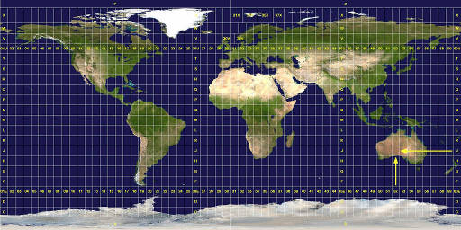
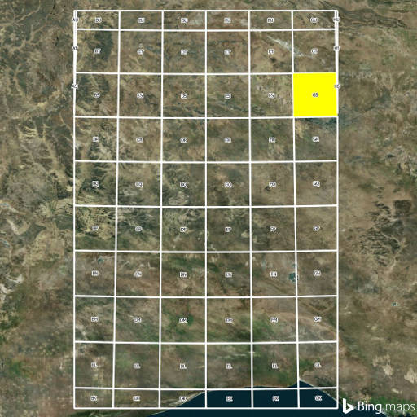
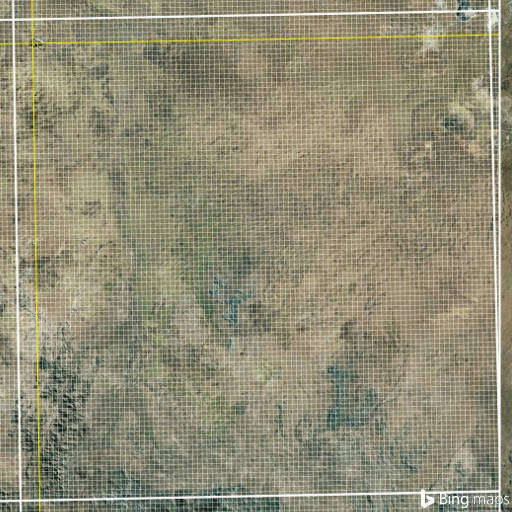
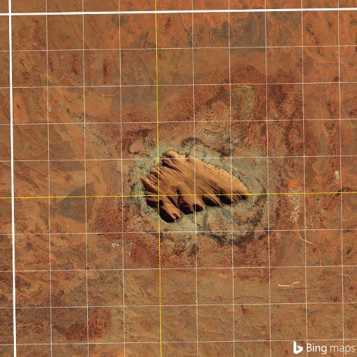

# PyUTM

PyUTM is a Python package that creates standardized grid references for point data.
It can also use those grid references to create spatially meaningful unique identifiers for tasks such as asset naming.

Grid references can be created in the following formats:
- US National Grid (USNG)
- Military Grid Reference System (MGRS)
- Universal Transverse Mercator (UTM) (*in progress*)

For a discussion regarding the benefits of using the US National Grid, see this awesome document.

## Table of Contents

[What is a grid reference?](#what-is-a-grid-reference)

- [Reading a grid reference](#reading-a-usng-or-mgrs-grid-reference)

[What is a unique identifier?](#what-is-a-unique-identifier)

[Examples](#examples)

- [Create a Grid object](#1-create-a-grid-object)
- [Call the write_refs() method](#2-call-the-write_refs-method)
- [Call the write_uids() method](#3-call-the-write_uids-method)

[References](#references)

### What is a grid reference?

Based on the Universal Transverse Mercator (UTM) and Universal Polar Stereographic (UPS) map projections,
**a grid reference allows any location in the world to be described by a string of up to 15 characters**.
The precision of a location increases as characters are added to its grid reference and
decreases as characters are removed.

The following are all valid examples of grid references at different levels of precision:
- 18LVJ
- 12JXQ69
- 30UWB8270
- 36RUU203175
- **33MXS97396762**
- 44RKR0691609280

The **first set** of characters in a grid reference describes its **Grid Zone Designation** (GZD).
- This is usually three characters long and is comprised of a number between 1 and 60 followed by a letter: **33M**.
- By default, PyUTM adds a leading zero to numbers less than 10: **02U**.
- With some exceptions in the northern latitudes and at the poles, the GZD describes a standard area encompassing
6° of longitude and 8° of latitude.
- The letters 'I' and 'O' are omitted to avoid confusion with the numbers '1' and '0'.

The **second set** of characters in a grid reference describes its **100 kilometer square** within the GZD.
- This is always two characters long and is comprised of two letters, again omitting 'I' and 'O': **XS**.
- Though the majority of squares within a GZD are 100 km on each side, those located on the edges of the GZD can be
smaller in area, due to the [conformal nature of the projections](https://en.wikipedia.org/wiki/Conformal_map_projection)
from which the grid references are derived.

The **third and fourth sets** of characters in a grid reference describe its distance in meters from the lower left
corner of the 100 km square. The third set of characters describes the **location's distance east** of the lower left corner (its *easting*),
while the fourth set of characters describes the **location's distance north** of the lower left corner (its *northing*).
- Both sets can be between zero and five characters long and are comprised entirely of digits; they must have the same
number of characters and are not separated by a space: **97396762** represents a location of **9739 easting** and **6762 northing**.
- The number of digits used in each set determines the number of meters that those digits represent. As the number of
digits increases from zero to five, so does the precision with which a location can be established within the 100 km square:

Number of Digits | Precision in Meters | Size of Location
:---: | :---: | :---:
Zero | 100 000 | Regional Area
One | 10 000 | Local Area
Two | 1 000 | Neighborhood
Three | 100 | Football Field
Four | 10 | House
Five | 1 | Bath towel

### Reading a USNG or MGRS grid reference

To locate the area described by a grid reference, break the grid reference down into its component sets
then read from left to right.

For example, **52JGS0495** contains the following sets:
- GZD: 52J
- 100 km square: GS
- Distance: 0495
  - Easting: 04
  - Northing: 95

This grid reference therefore describes a location...

- ...within grid zone **52J**...



- ...that is within the 100 km square **GS**.



- Because the easting and northing contain **two** digits, they describe a location with a precision of 1,000 meters (1 km),
found **4 km east** and **95 km north** of the 100 km square's lower left corner:



- Here we see the location described by 52JGS0495: [Uluru](https://en.wikipedia.org/wiki/Uluru).



Note that the grid reference does **not** describe the **point** where the easting and northing cross,
but rather the **entire 1 km square** to the northeast of that point.
To describe a smaller area, we would add digits to the distance, thereby increasing its precision.

### What is a unique identifier?

A unique identifier (UID) modifies a point's grid reference by adding a numeric suffix to insure that **each reference-based ID
within the dataset is unique**, even when two points may share the same grid reference.
It can add prefixes to the reference to make the UID more meaningful or remove character sets from the standard grid
reference to make a UID shorter; it also adds a delimiter between the character sets to improve readability.
  - **M-XS-9739-6762-3** is a UID containing both a custom prefix and numeric suffix;
the GZD has not been used and delimiters have been added to separate the character sets.

## Examples

To install PyUTM, use PyPI:[*](#nb)
```
pip install pyutm
```

### 1. Create a `Grid()` object

`Grid(data, columns=None, epsg=4326)`

- `data`: the point data used to construct the grid references and UIDs
  - The data can be either a list of coordinates or a file path to a CSV or shapefile
  - Lists should be in the following format: `[(X coordinate, Y coordinate), ...]`
- `columns`: if the data is in CSV format, these are the columns that hold the coordinates
  - The argument should be passed in the following format: `[X coordinate, Y coordinate]`
- `epsg`: the EPSG number of the data's coordinate reference system
  - The default EPSG is **4326** (WGS 84)
 
 ```python
>>> import pyutm
# Create a grid object from a list of longitudes and latitudes
>>> lonlat = [(16.776031, -3.005612), (16.772291, -3.007136)]
>>> grid_from_list = pyutm.Grid(lonlat)
# Create a grid object from a CSV file
>>> grid_from_csv = pyutm.Grid('my_points.csv', columns=['LON', 'LAT'])
# Create a grid object from a shapefile in WGS 84 Web Mercator (Auxiliary Sphere)
>>> grid_from_shp = pyutm.Grid('my_points.shp', epsg=3857)
```

### 2. Call the `write_refs()` method

If a file name is specified, this function writes the grid **ref**erence of each point to the file.
If the input data is in the CSV or shapefile format, the grid references are added as a new column to the file.

This function always returns a list in the form `[[X, Y, 'Grid Reference'], ...]`.

`write_refs(fname=None, ref_column='GRID_REFS', precision=10)`

- `fname` *(optional)*: the name of the file to which the grid references are written
  - The output file must be in the same format as the input data
- `ref_column`: the header of the column to which the grid references are written
  - The default column name is **GRID_REFS** 
- `precision`: the desired precision of the grid references, in meters
  - The default precision is **10 meters**

```python
>>> lon_lat = (16.776031, -3.005612)
>>> my_grid = pyutm.Grid(lon_lat)
# Create grid references
>>> my_ref = my_grid.write_refs()
>>> my_ref
[[16.776031, -3.005612, '33MXS97386762']]
# Specify the precision of the grid reference
>>> my_1m_ref = my_grid.write_refs(precision=1)
>>> my_1m_ref
[[16.776031, -3.005612, '33MXS9738967626']]
# Create grid references from a CSV file
>>> grid_from_csv = pyutm.Grid('my_points.csv', column=['LON', 'LAT'])
# Write the grid references to a new CSV with a custom column name
>>> grid_from_csv.write_refs('my_refs.csv', ref_column='MY_REFS')
# Create grid references from a shapefile
>>> grid_from_shp = pyutm.Grid('my_points.shp')
# Write the grid references to a new shapefile with 10 km precision
>>> grid_from_shp.write_refs('my_refs.shp', precision=10000)
```

### 3. Call the `write_uids()` method

If a file name is specified, this function writes the **u**nique **id**entifiers of each point to the file.
If the input data is in the CSV or shapefile format, the UIDs are added as a new column to the file.

This function always returns a list in the form `[[X, Y, 'UID'], ...]`.

`write_uids(fname=None, uid_column='UID_REFS', precision=10, prefix=None, prefix_column=None, gzd=True, k100=True, delimiter='-')`

- `fname` *(optional)*: the name of the file to which the UIDs are written
  - The output file must be in the same format as the input data
- `uid_column`: the header of the column to which the UIDs are written
  - The default column name is **UID_REFS** 
- `precision`: the desired precision of the UIDs, in meters
  - The default precision is **10 meters**
- `prefix`: the prefix to be added to all UIDs
- `prefix_column`: the name of the data column containing prefix characters
- `gzd`: whether to include the Grid Zone Designation in the UIDs
  - The default is **True**
- `k100`: whether to include the 100 kilometer square in the UIDs
  - The default is **True**
- `delimiter`: the character(s) used to separate the character sets
  - The default character is a dash: **-**

# TODO CHANGE THIS CODE BLOCK
```python
>>> lon_lat = (16.776031, -3.005612)
>>> my_grid = pyutm.Grid(lon_lat)
# Create grid references
>>> my_ref = my_grid.write_refs()
>>> my_ref
[[16.776031, -3.005612, '33MXS97386762']]
# Specify the precision of the grid reference
>>> my_1m_ref = my_grid.write_refs(precision=1)
>>> my_1m_ref
[[16.776031, -3.005612, '33MXS9738967626']]
# Create grid references from a CSV file
>>> grid_from_csv = pyutm.Grid('my_points.csv', column=['LON', 'LAT'])
# Write the grid references to a new CSV with a custom column name
>>> grid_from_csv.write_refs('my_refs.csv', ref_column='MY_REFS')
# Create grid references from a shapefile
>>> grid_from_shp = pyutm.Grid('my_points.shp')
# Write the grid references to a new shapefile with 10 km precision
>>> grid_from_shp.write_refs('my_refs.shp', precision=10000)
```

##### N.B.

*Python 2.7 users must install the
[Microsoft Visual C++ Compiler for Python 2.7](https://www.microsoft.com/en-us/download/details.aspx?id=44266)
before using this package.*

## References

National Geospatial-Intelligence Agency, *The Universal Grids and the Transverse Mercator and Polar Stereographic Map Projections*,
[NGA Standardization Document NGA.SIG.0012_2.0.0_UTMUPS](http://earth-info.nga.mil/GandG/publications/NGA_SIG_0012_2_0_0_UTMUPS/NGA.SIG.0012_2.0.0_UTMUPS.pdf).
Washington, D.C.: Office of Geomatics, 2014.
- PyUTM will eventually implement the logic found in Sections 11, 12 and 14 of this document.

National Geospatial-Intelligence Agency, *Universal Grids and Grid Reference Systems*,
[NGA Standardization Document NGA.STND.0037_2.0.0_GRIDS](http://earth-info.nga.mil/GandG/publications/NGA_STND_0037_2_0_0_GRIDS/NGA.STND.0037_2.0.0_GRIDS.pdf).
Washington, D.C.: Office of Geomatics, 2014.
- Though broader in scope than the previous document, Chapter 3 and Appendices A and B are particularly helpful.
- PyUTM currently implements a version of the logic found in Appendix B of this document.
